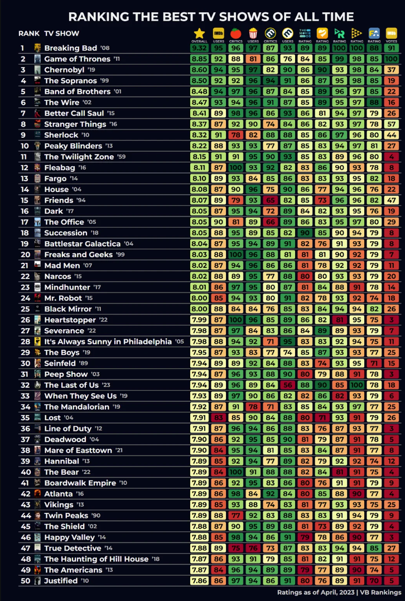
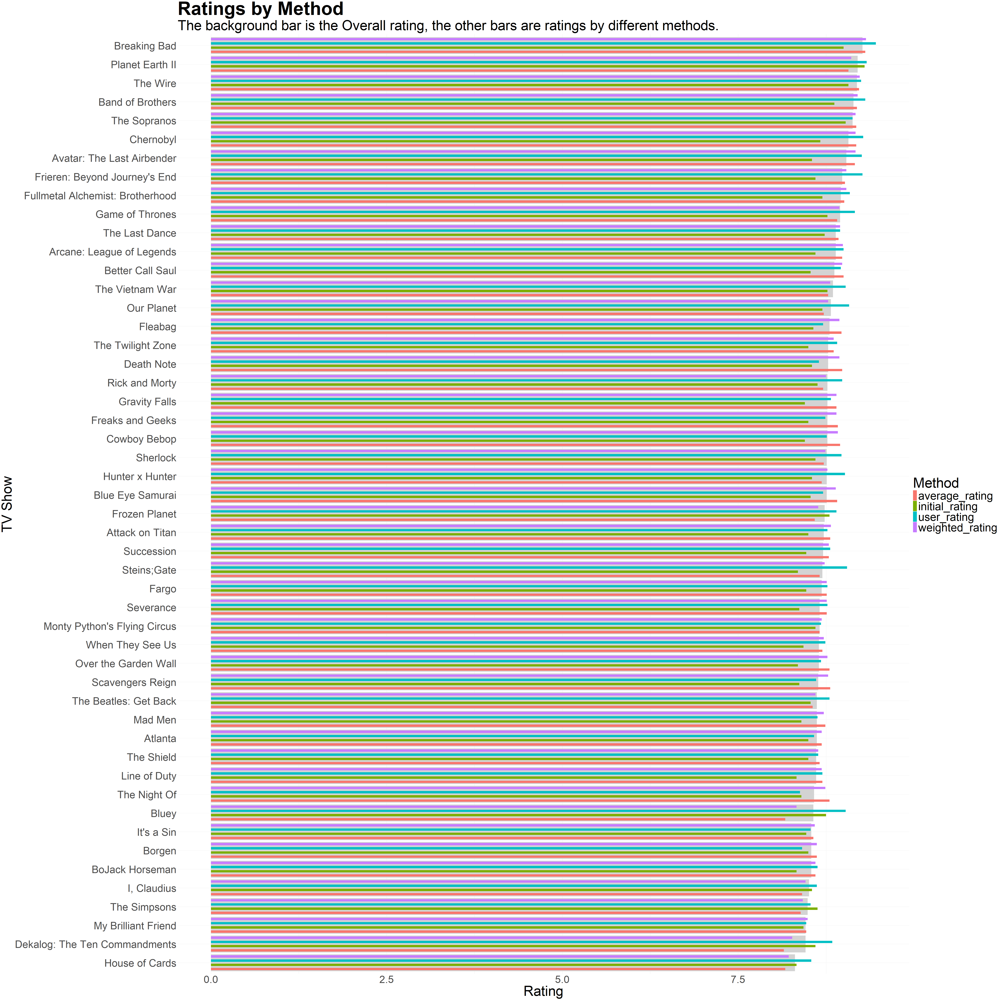

Final Report
================
Aiden Streicher
May 11th, 2025

My name is Aiden Streicher. I ended up doing this project solo.

My goal for this project is to find the best TV shows of all time
according to the community. I was inspired by this photo that has made
its way around the internet over the years.

``` r

```

<!-- -->

There are a lot of good TV shows at the top of the list, but there are
also many issues with this rankings. Specifically I want to point out 3
issues I found and hope to improve on with this ranking.

1.  It doesn’t include any animated TV shows. There are a lot of
    animated shows that would likely appear in the top 10, but aren’t
    included for some reason. The list is meant to be best TV shows of
    all time, not best live action TV shows of all time.

2.  Some of the sources are poorly defined. In particular the last
    source seems to be some sort of “IMDB Vote?”. This skews the
    rankings heavily to the top 2 and clearly doesn’t belong in a
    ranking like this.

3.  It doesn’t take into account how many people voted on each site. If
    1,000,000 people use IMDB for TV shows and 100,000 use metacritic
    user votes for the same thing, they are still weighted equally
    despite there being a lot less people on one site. I’ll get into it
    later but this is the hardest issue to fix for a variety of reasons.

My goal is to build off this, and make my own list of the best TV shows
of all time.

The first step is gathering data and creating a list. I ended up
deciding on a 2 step process to create this list, and broke down the
sources into 3 categories. I plan to create an initial list of the top
50 TV shows using some of these sources, and then manually add the data
for other sources after to adjust the pre-defined top 50 list. I will
also not be using a few of the sources above. I’ll explain each source
and my reasoning below.

USING FOR INITIAL LIST:

These websites will be used to create the initial top 50 list.

IMDB- This is the best source when it comes to TV shows for a few
reasons. It has the most users of any website and includes all types of
TV shows. It also has an easy to access list of the top rated TV shows
and is very easy to scape. One of my takeaways is that IMDB is the gold
standard for data collection when looking at TV shows. I used this list:
<https://www.imdb.com/chart/toptv/?sort=user_rating%2Cdesc>

Film Affinity- This is another website that has a decently sized user
base and includes all types of TV shows. My biggest issue was scraping
the data as it loaded in TV shows from a server, but once I got it
figured out it worked great. I used this list:
<https://www.filmaffinity.com/us/ranking.php?rn=ranking_fa_series>

Metacritic Metascore- This is different from the other 2 enteries I’m
using as this provides a critical opinion rather than a user opinion. I
think the variety helps, and it was also easy to scrape the data. The
biggest problem is that it does not include any anime TV shows (although
it does incldue western animated shows) so to account for this for the
top 50 list it will look for the average rating of all websites with a
score. I used this list:
<https://www.metacritic.com/browse/tv/?releaseYearMin=1910&releaseYearMax=2025&page=1>

ADDING DATA AFTER:

These websites will have their ratings manually entered for the top 50
shows after the list is created. This is due to a variety of reasons
depending on the website.

Rotten Tomatoes (Critic and User), Taste- The main reason why this
wasn’t included initially is because the sorting on this website is
terrible. If you want to find a list of the best TV shows of all time
for either critic or users you get a lot of results that are just 100%
with a small number of votes. If you try to sort by most popular you
just get a lot of new TV shows. Because of this I couldn’t find a good
list to get reliable data from. I’m still skeptical about including
critic score because they give 100% to a LOT of shows, but I decided to
leave it in. Taste also has sorting issues where it just shows the most
popular new shows. Websites- <https://www.rottentomatoes.com/>,
<https://www.taste.io/>

ReelGood, JustWatch, The Movie DB (TMDB)- These all fall into the same
catagory where there was some problem with scraping the data. In the
case of TMDB I was able to scrape the first 20 TV shows, but the rest
were not avaliable. It also has a very strong anime and recency bias. In
the case of JustWatch the JustWatch ratings are hidden in each TV’s show
page which makes scraping the data very difficult and outside my skill
level. ReelGood I also had scraping issues with. Websites-
<https://www.themoviedb.org/tv/top-rated?language=en-US>,
<https://reelgood.com/tv/curated/trending-picks?filter-sort=8>,
<https://www.justwatch.com/us/guide/best-tv-shows-all-time>

MyAnimeList- This is probably going to be the most controversial
addition due to the fact that the website only has eastern animated
shows (which will make up about 10-15% of the top 50). The biggest
reason for adding it though is because it captures a VERY large amount
of people that would otherwise go un-represented. For example the show
Hunter x Hunter has ~178k votes from other sources, but has over 1.8
million votes on MAL. Considering there were a few sources that had no
anime this felt like a good way to balance it out, although I think
there are strong arguments for not adding it as well.

NOT USING:

IMDB Votes- I’m not fully sure what this is but based off the ratings it
doesn’t belong in this dataset. It may have been included to generate
clicks on social media.

Other Sources- I considered adding other sources but they all had
various problems which made me stick to the ones above. The main one I
considered is Letterboxd but they only have some TV shows and not all in
their database so they wern’t fit for this project.

------------------------------------------------------------------------

Now that we have our sources its time to create the initial list of the
top 50 movies of all time!

If there were any scores listed as N/A that could be added I added them
and ran it again until we got the most complete valid list possible.

I also made it so the minimum number of votes was 20,000 as a top TV
show needs to be at least a little bit popular. This seems like a lot
but most TV shows (even less popular ones) passed this bar no problem.

``` r
#Make it so each database keeps their scores and votes (if applicable)
imdb <- imdb %>% rename(Imdb_Score = User.Score, Imdb_Votes = Number.of.Votes)
FA <- FA %>% rename(FA_Score = Score, FA_Votes = Number_Votes)
metacritic <- metacritic %>% rename(Metacritic_Score = Score)

#Merge the data
merged_data <- imdb %>%
  full_join(FA, by = "Title", relationship = "many-to-many") %>%
  full_join(metacritic, by = "Title", relationship = "many-to-many")

#We want each TV show to be in at least 2 of the lists (because of metacritics no anime)
merged_data <- merged_data %>%
  mutate(score_count = (!is.na(Imdb_Score)) + (!is.na(FA_Score)) + (!is.na(Metacritic_Score))) %>%
  filter(score_count >= 2)

#Get average score
merged_data <- merged_data %>%
  mutate(Average_Score = rowMeans(select(., Imdb_Score, FA_Score, Metacritic_Score), na.rm = TRUE))

#Make the number of votes numeric
merged_data <- merged_data %>%
  mutate(
    # Remove commas and convert to character (in case of factor), then to numeric.
    Imdb_Votes = as.numeric(gsub(",", "", as.character(Imdb_Votes))),
    FA_Votes   = as.numeric(gsub(",", "", as.character(FA_Votes)))
  )

#Get total number of votes
merged_data <- merged_data %>%
  mutate(Imdb_Votes = ifelse(is.na(Imdb_Votes), 0, Imdb_Votes),
         FA_Votes = ifelse(is.na(FA_Votes), 0, FA_Votes),
         Total_Votes = Imdb_Votes + FA_Votes)

#If there are less then 20,000 votes the TV show is filtered out
merged_data <- merged_data %>%
  filter(Total_Votes >= 20000)

#Rank by average score (highest first) and take the top 50 TV shows.
top_50 <- merged_data %>%
  arrange(desc(Average_Score)) %>%
  slice_head(n = 50)

#Replace missing scores in each source with "N/A"
top_50 <- top_50 %>%
  mutate(Average_Score = round(Average_Score, 2),
         Imdb_Score = ifelse(is.na(Imdb_Score), "N/A", as.character(Imdb_Score)),
         FA_Score = ifelse(is.na(FA_Score), "N/A", as.character(FA_Score)),
         Metacritic_Score = ifelse(is.na(Metacritic_Score), "N/A", as.character(Metacritic_Score))) %>%
  select(Title, Imdb_Score, Imdb_Votes, FA_Score, FA_Votes, Metacritic_Score, Average_Score, Total_Votes)

write_csv(top_50, "Top_50.csv")

head(top_50)
```

    ##              Title Imdb_Score Imdb_Votes FA_Score FA_Votes Metacritic_Score
    ## 1  Planet Earth II        9.4     166414      8.9     4596              9.6
    ## 2         The Wire        9.3     402898      8.8    50549              9.1
    ## 3     The Sopranos        9.2     523915      8.5    60476              9.4
    ## 4     Breaking Bad        9.5    2328705      8.8   106135              8.7
    ## 5 Band of Brothers        9.4     561514      8.5    62566              8.7
    ## 6    Frozen Planet          9      35606      8.3     1084              9.1
    ##   Average_Score Total_Votes
    ## 1          9.30      171010
    ## 2          9.07      453447
    ## 3          9.03      584391
    ## 4          9.00     2434840
    ## 5          8.87      624080
    ## 6          8.80       36690

Now we have our initial list. Next I will manually add data for the
other websites about these 50 shows.

Interesting Findings while doing this:

Dekalog has 31,000 ratings on IMDB. Despite this it only has 2,970 on
every other website combined, which is the lowest number by far.

Bluey has an average rating of 9.3 on IMDB but 8.0 on all the other
websites, one of the biggest discrepancies.

Severence scored a relatively low 7.9 on Rotten Tomatoes user score, one
of its lowest scores given. Despite this it outperformed the average on
every other non-core website.

Similarly Steins Gate scored abnormally poorly on both ReelGood and
Justwatch, compared to its very high ratings on Rotten Tomatoes and MAL

House of Cards preformed very poorly on Rotten Tomatoes (both user and
critic) and Taste, but preformed well on other websites.

Now that this is done we can see how all the websites like the top 50
shows.

``` r
website_data <- read.csv("Full_Top50_Data.csv")

head(website_data)
```

    ##              Title Tomato_Critic Tomato_User Taste Taste_Users ReelGood
    ## 1  Planet Earth II            10         9.4   8.5        9700      8.6
    ## 2         The Wire           9.5         9.6   8.9       11000      9.7
    ## 3     The Sopranos           9.2         9.6   8.7       13800      9.8
    ## 4     Breaking Bad           9.6         9.7   8.9       90700     10.0
    ## 5 Band of Brothers           9.4         9.7   8.9       16900      9.8
    ## 6    Frozen Planet           N/A          10   7.9        2600      7.5
    ##   ReelGood_Users JustWatch JustWatch_Users TMDB TMDB_Users MAL MAL_Users  FA
    ## 1            405       8.6            1300  8.6        821 N/A       N/A 8.9
    ## 2           4238       9.5           21000  8.6       2355 N/A       N/A 8.8
    ## 3           4700       9.5           22000  8.7       2960 N/A       N/A 8.5
    ## 4          15000       9.7           79000  8.9      15520 N/A       N/A 8.8
    ## 5           3900       9.7           24000  8.6       3746 N/A       N/A 8.5
    ## 6             88       N/A             N/A  8.3        280 N/A       N/A 8.3
    ##   FA_Users Imdb Imdb_Users Metacritic_Score
    ## 1     4596  9.4     166414              9.6
    ## 2    50549  9.3     402898              9.1
    ## 3    60476  9.2     523915              9.4
    ## 4   106135  9.5    2328705              8.7
    ## 5    62566  9.4     561514              8.7
    ## 6     1084  9.0      35606              9.1

From this I want to try out 3 different methods of rankings and compare
them.

1.  Take the average score from each source. The upside is this is
    straightforward and everything gets included. The downside is the
    representation is unbalanced. I’ll call this the average_rating.

2.  Get a “Score” from each website with users (website score \* num
    users), add them up and divide by total number of viewers for that
    show. The upside is this is the best for general representation. The
    downside is that not every website reports how many users, and can’t
    be included. I’ll call this the user_rating.

3.  Try and combine the two ideas by giving more popular websites more
    weight, while still including every website. This is a very
    subjective approach as I don’t have a formula to determine the
    weight, but should be a good middle ground. I’ll call this the
    weighted_rating.

First I’ll create the first new ranking.

``` r
#All the columns with "Users" in it are for counting total votes
rating_cols <- names(website_data)[!grepl("Users$", names(website_data))]
rating_cols <- setdiff(rating_cols, "Title")
user_cols <- names(website_data)[grepl("Users$", names(website_data))]

#Convert columns that aren't title to numeric
website_data <- website_data %>%
  mutate(across(all_of(rating_cols), ~ parse_number(na_if(as.character(.), "N/A"))))
website_data <- website_data %>%
  mutate(across(all_of(user_cols), ~ parse_number(na_if(as.character(.), "N/A"))))

#Get the avearge rating ignoring user counts
website_data <- website_data %>%
  rowwise() %>%
  mutate(average_rating = mean(c_across(all_of(rating_cols)), na.rm = TRUE)) %>%
  ungroup() %>%
  mutate(average_rating = round(average_rating, 2))

#Put this information in a new csv
average_rating <- website_data %>% 
  select(Title, average_rating) %>%
  arrange(desc(average_rating))

write_csv(average_rating, "average_rating.csv")

head(average_rating)
```

    ## # A tibble: 6 × 2
    ##   Title                      average_rating
    ##   <chr>                               <dbl>
    ## 1 Breaking Bad                         9.31
    ## 2 The Wire                             9.22
    ## 3 Band of Brothers                     9.19
    ## 4 The Sopranos                         9.18
    ## 5 Chernobyl                            9.18
    ## 6 Avatar: The Last Airbender           9.16

This shifted things up quite a bit, with Planet Earth II moving down and
Breaking Bad and Chernobyl moving up.

Next we’ll do the same thing but count each users vote.

``` r
#Every rating column with the number of user vote is in the format "Name" for the website rating
#and "Name_Users" for the number of votes that tv show got from the website

#This isolates these pairs so we can get a "User score" from each website
user_cols <- names(website_data)[grepl("_Users$", names(website_data))]
rating_cols <- sub("_Users$", "", user_cols)
paired_indices <- rating_cols %in% names(website_data)
user_cols <- user_cols[paired_indices]
rating_cols <- rating_cols[paired_indices]

#For each pair we want the number of votes * the rating
website_data <- website_data %>%
  rowwise() %>%
  mutate(
    #Total number of votes across all websites
    total_votes = sum(c_across(all_of(user_cols)), na.rm = TRUE),
    #Sum of the weighted "users" for each website
    weighted_sum = sum(c_across(all_of(rating_cols)) * c_across(all_of(user_cols)), na.rm = TRUE)
  ) %>%
  ungroup() %>%
  mutate(
    user_rating = if_else(total_votes > 0, round(weighted_sum / total_votes, 2), NA_real_)
  )

#Dataset with this user score
user_rating_csv <- website_data %>%
  select(Title, user_rating) %>%
  arrange(desc(user_rating))

write_csv(user_rating_csv, "user_rating.csv")

head(user_rating_csv)
```

    ## # A tibble: 6 × 2
    ##   Title                         user_rating
    ##   <chr>                               <dbl>
    ## 1 Breaking Bad                         9.46
    ## 2 Planet Earth II                      9.33
    ## 3 Band of Brothers                     9.31
    ## 4 Chernobyl                            9.28
    ## 5 Frieren: Beyond Journey's End        9.27
    ## 6 Avatar: The Last Airbender           9.26

In this one Breaking Bad remains king while Planet Earth II surges back
up. Both The Wire and The Sopranos dropped out of the top 5 while Band
of Brothers and Frieren is the first anime to crack it.

Lastly I want to try and do a weighted score. MAL and IMDB both contain
by far the most users so their raitings will be 2.5x more important.
Taste, Justwatch and FA both have more than the rest, so they will be
factored by 1.25x. Lastly tomato critic and metacritic will also be
weighted at 1.25x to give a bit more weight to the critics.

All these numbres could obviously be adjusted based on what you think is
the right distriubution but lets see how it turns out.

``` r
#The columns that have ratings
rating_cols <- c("Tomato_Critic", "Tomato_User", "Taste", "ReelGood", 
                 "JustWatch", "TMDB", "MAL", "FA", "Imdb", "Metacritic_Score")

#The weight for each rating source
weights <- c(
  "Tomato_Critic"    = 1.25,
  "Tomato_User"      = 1.0,
  "Taste"            = 1.25,
  "ReelGood"         = 1.0,
  "JustWatch"        = 1.25,
  "TMDB"             = 1.0,
  "MAL"              = 2.5,
  "FA"               = 1.25,
  "Imdb"             = 2.5,
  "Metacritic_Score" = 1.25
)

weighted_score <- website_data %>%
  rowwise() %>%
  mutate(
    weighted_sum = sum(c_across(all_of(rating_cols)) * weights[rating_cols], na.rm = TRUE),
    total_weight = sum(if_else(!is.na(c_across(all_of(rating_cols))), 
                               weights[rating_cols], 
                               0), na.rm = TRUE),
    weighted_rating = if_else(total_weight > 0, round(weighted_sum / total_weight, 2), NA_real_)
  ) %>%
  ungroup() %>%
  arrange(desc(weighted_rating)) %>%
  select(Title, weighted_rating)

#put this new data in a csv
write_csv(weighted_score, "weighted_score.csv")

head(weighted_score)
```

    ## # A tibble: 6 × 2
    ##   Title                      weighted_rating
    ##   <chr>                                <dbl>
    ## 1 Breaking Bad                          9.32
    ## 2 The Wire                              9.23
    ## 3 Band of Brothers                      9.2 
    ## 4 The Sopranos                          9.17
    ## 5 Chernobyl                             9.17
    ## 6 Avatar: The Last Airbender            9.17

Now we have the data for all 3 of our different methods, along with the
initial list of 50. Now I’ll visualise it in a varety of different ways.
First I want 2 lists, one of each shows rating per method, and one of
its placement per method.

``` r
#Combine all the scores
#Inital Rating is the first ratings, the others keep their name from earlier

#Overall Rating is the average of the 4 other ratings
combined_ratings <- average_rating %>%
  left_join(user_rating_csv, by = "Title") %>%
  left_join(top_50, by = "Title") %>%
  left_join(weighted_score, by = "Title") %>%
  rowwise() %>%
  mutate(Overall_Rating = round(mean(c(average_rating, user_rating, weighted_rating, Average_Score), na.rm = TRUE), 2)) %>%
  ungroup() %>%
  select(Title, Average_Score, average_rating, user_rating, weighted_rating, Overall_Rating)

combined_ratings <- combined_ratings %>%
  rename(initial_rating = Average_Score) %>%
  arrange(desc(Overall_Rating))

head(combined_ratings)
```

    ## # A tibble: 6 × 6
    ##   Title initial_rating average_rating user_rating weighted_rating Overall_Rating
    ##   <chr>          <dbl>          <dbl>       <dbl>           <dbl>          <dbl>
    ## 1 Brea…           9              9.31        9.46            9.32           9.27
    ## 2 Plan…           9.3            9.07        9.33            9.11           9.2 
    ## 3 The …           9.07           9.22        9.25            9.23           9.19
    ## 4 Band…           8.87           9.19        9.31            9.2            9.14
    ## 5 The …           9.03           9.18        9.13            9.17           9.13
    ## 6 Cher…           8.67           9.18        9.28            9.17           9.07

``` r
#Now this is a list of the 1-50 rankings each show got
#on each list

placements <- combined_ratings %>%
  mutate(
    Rank_Simple   = min_rank(desc(average_rating)),
    Rank_User     = min_rank(desc(user_rating)),
    Rank_Weighted = min_rank(desc(weighted_rating)),
    Rank_Inital   = min_rank(desc(initial_rating))
  ) %>%
  # Compute an average rank
  mutate(Rank_Overall = round((Rank_Simple + Rank_User + Rank_Weighted+Rank_Inital) / 4, 1)) %>%
  select(Title, Rank_Inital, Rank_Simple, Rank_User, Rank_Weighted, Rank_Overall) %>%
  arrange(Rank_Overall)


head(placements)
```

    ## # A tibble: 6 × 6
    ##   Title            Rank_Inital Rank_Simple Rank_User Rank_Weighted Rank_Overall
    ##   <chr>                  <int>       <int>     <int>         <int>        <dbl>
    ## 1 Breaking Bad               4           1         1             1          1.8
    ## 2 The Wire                   2           2         7             2          3.2
    ## 3 Band of Brothers           5           3         3             3          3.5
    ## 4 Planet Earth II            1           7         2             7          4.2
    ## 5 The Sopranos               3           4         9             4          5  
    ## 6 Chernobyl                 13           4         4             4          6.2

Whats interesting is despite having a lower overall average rating, The
Wire and Band of Brothers have a higher average list placement.

Lets make this data look nice. I’m using the formattable package. Green
shows higher numbers and red lower numbers.

``` r
formattable(combined_ratings, list(
  initial_rating = color_tile("red", "green"),
  average_rating = color_tile("red", "green"),
  user_rating   = color_tile("red", "green"),
  weighted_rating = color_tile("red", "green"),
  Overall_Rating = color_tile("red", "green")
))
```

<table class="table table-condensed">
<thead>
<tr>
<th style="text-align:right;">
Title
</th>
<th style="text-align:right;">
initial_rating
</th>
<th style="text-align:right;">
average_rating
</th>
<th style="text-align:right;">
user_rating
</th>
<th style="text-align:right;">
weighted_rating
</th>
<th style="text-align:right;">
Overall_Rating
</th>
</tr>
</thead>
<tbody>
<tr>
<td style="text-align:right;">
Breaking Bad
</td>
<td style="text-align:right;">
<span style="display: block; padding: 0 4px; border-radius: 4px; background-color: #4eb000">9.00</span>
</td>
<td style="text-align:right;">
<span style="display: block; padding: 0 4px; border-radius: 4px; background-color: #00ff00">9.31</span>
</td>
<td style="text-align:right;">
<span style="display: block; padding: 0 4px; border-radius: 4px; background-color: #00ff00">9.46</span>
</td>
<td style="text-align:right;">
<span style="display: block; padding: 0 4px; border-radius: 4px; background-color: #00ff00">9.32</span>
</td>
<td style="text-align:right;">
<span style="display: block; padding: 0 4px; border-radius: 4px; background-color: #00ff00">9.27</span>
</td>
</tr>
<tr>
<td style="text-align:right;">
Planet Earth II
</td>
<td style="text-align:right;">
<span style="display: block; padding: 0 4px; border-radius: 4px; background-color: #00ff00">9.30</span>
</td>
<td style="text-align:right;">
<span style="display: block; padding: 0 4px; border-radius: 4px; background-color: #34ca00">9.07</span>
</td>
<td style="text-align:right;">
<span style="display: block; padding: 0 4px; border-radius: 4px; background-color: #1ee000">9.33</span>
</td>
<td style="text-align:right;">
<span style="display: block; padding: 0 4px; border-radius: 4px; background-color: #30ce00">9.11</span>
</td>
<td style="text-align:right;">
<span style="display: block; padding: 0 4px; border-radius: 4px; background-color: #12ec00">9.20</span>
</td>
</tr>
<tr>
<td style="text-align:right;">
The Wire
</td>
<td style="text-align:right;">
<span style="display: block; padding: 0 4px; border-radius: 4px; background-color: #3cc200">9.07</span>
</td>
<td style="text-align:right;">
<span style="display: block; padding: 0 4px; border-radius: 4px; background-color: #13eb00">9.22</span>
</td>
<td style="text-align:right;">
<span style="display: block; padding: 0 4px; border-radius: 4px; background-color: #31cd00">9.25</span>
</td>
<td style="text-align:right;">
<span style="display: block; padding: 0 4px; border-radius: 4px; background-color: #14ea00">9.23</span>
</td>
<td style="text-align:right;">
<span style="display: block; padding: 0 4px; border-radius: 4px; background-color: #15e900">9.19</span>
</td>
</tr>
<tr>
<td style="text-align:right;">
Band of Brothers
</td>
<td style="text-align:right;">
<span style="display: block; padding: 0 4px; border-radius: 4px; background-color: #718d00">8.87</span>
</td>
<td style="text-align:right;">
<span style="display: block; padding: 0 4px; border-radius: 4px; background-color: #1ae400">9.19</span>
</td>
<td style="text-align:right;">
<span style="display: block; padding: 0 4px; border-radius: 4px; background-color: #23db00">9.31</span>
</td>
<td style="text-align:right;">
<span style="display: block; padding: 0 4px; border-radius: 4px; background-color: #1be300">9.20</span>
</td>
<td style="text-align:right;">
<span style="display: block; padding: 0 4px; border-radius: 4px; background-color: #22dc00">9.14</span>
</td>
</tr>
<tr>
<td style="text-align:right;">
The Sopranos
</td>
<td style="text-align:right;">
<span style="display: block; padding: 0 4px; border-radius: 4px; background-color: #46b800">9.03</span>
</td>
<td style="text-align:right;">
<span style="display: block; padding: 0 4px; border-radius: 4px; background-color: #1ce200">9.18</span>
</td>
<td style="text-align:right;">
<span style="display: block; padding: 0 4px; border-radius: 4px; background-color: #4db100">9.13</span>
</td>
<td style="text-align:right;">
<span style="display: block; padding: 0 4px; border-radius: 4px; background-color: #22dc00">9.17</span>
</td>
<td style="text-align:right;">
<span style="display: block; padding: 0 4px; border-radius: 4px; background-color: #25d900">9.13</span>
</td>
</tr>
<tr>
<td style="text-align:right;">
Chernobyl
</td>
<td style="text-align:right;">
<span style="display: block; padding: 0 4px; border-radius: 4px; background-color: #a55900">8.67</span>
</td>
<td style="text-align:right;">
<span style="display: block; padding: 0 4px; border-radius: 4px; background-color: #1ce200">9.18</span>
</td>
<td style="text-align:right;">
<span style="display: block; padding: 0 4px; border-radius: 4px; background-color: #2ad400">9.28</span>
</td>
<td style="text-align:right;">
<span style="display: block; padding: 0 4px; border-radius: 4px; background-color: #22dc00">9.17</span>
</td>
<td style="text-align:right;">
<span style="display: block; padding: 0 4px; border-radius: 4px; background-color: #35c900">9.07</span>
</td>
</tr>
<tr>
<td style="text-align:right;">
Avatar: The Last Airbender
</td>
<td style="text-align:right;">
<span style="display: block; padding: 0 4px; border-radius: 4px; background-color: #c53900">8.55</span>
</td>
<td style="text-align:right;">
<span style="display: block; padding: 0 4px; border-radius: 4px; background-color: #20de00">9.16</span>
</td>
<td style="text-align:right;">
<span style="display: block; padding: 0 4px; border-radius: 4px; background-color: #2fcf00">9.26</span>
</td>
<td style="text-align:right;">
<span style="display: block; padding: 0 4px; border-radius: 4px; background-color: #22dc00">9.17</span>
</td>
<td style="text-align:right;">
<span style="display: block; padding: 0 4px; border-radius: 4px; background-color: #3dc100">9.04</span>
</td>
</tr>
<tr>
<td style="text-align:right;">
Frieren: Beyond Journey’s End
</td>
<td style="text-align:right;">
<span style="display: block; padding: 0 4px; border-radius: 4px; background-color: #b84600">8.60</span>
</td>
<td style="text-align:right;">
<span style="display: block; padding: 0 4px; border-radius: 4px; background-color: #3fbf00">9.02</span>
</td>
<td style="text-align:right;">
<span style="display: block; padding: 0 4px; border-radius: 4px; background-color: #2cd200">9.27</span>
</td>
<td style="text-align:right;">
<span style="display: block; padding: 0 4px; border-radius: 4px; background-color: #40be00">9.04</span>
</td>
<td style="text-align:right;">
<span style="display: block; padding: 0 4px; border-radius: 4px; background-color: #4db100">8.98</span>
</td>
</tr>
<tr>
<td style="text-align:right;">
Fullmetal Alchemist: Brotherhood
</td>
<td style="text-align:right;">
<span style="display: block; padding: 0 4px; border-radius: 4px; background-color: #9d6100">8.70</span>
</td>
<td style="text-align:right;">
<span style="display: block; padding: 0 4px; border-radius: 4px; background-color: #41bd00">9.01</span>
</td>
<td style="text-align:right;">
<span style="display: block; padding: 0 4px; border-radius: 4px; background-color: #57a700">9.09</span>
</td>
<td style="text-align:right;">
<span style="display: block; padding: 0 4px; border-radius: 4px; background-color: #40be00">9.04</span>
</td>
<td style="text-align:right;">
<span style="display: block; padding: 0 4px; border-radius: 4px; background-color: #52ac00">8.96</span>
</td>
</tr>
<tr>
<td style="text-align:right;">
Game of Thrones
</td>
<td style="text-align:right;">
<span style="display: block; padding: 0 4px; border-radius: 4px; background-color: #8b7300">8.77</span>
</td>
<td style="text-align:right;">
<span style="display: block; padding: 0 4px; border-radius: 4px; background-color: #57a700">8.91</span>
</td>
<td style="text-align:right;">
<span style="display: block; padding: 0 4px; border-radius: 4px; background-color: #46b800">9.16</span>
</td>
<td style="text-align:right;">
<span style="display: block; padding: 0 4px; border-radius: 4px; background-color: #58a600">8.94</span>
</td>
<td style="text-align:right;">
<span style="display: block; padding: 0 4px; border-radius: 4px; background-color: #55a900">8.95</span>
</td>
</tr>
<tr>
<td style="text-align:right;">
Arcane: League of Legends
</td>
<td style="text-align:right;">
<span style="display: block; padding: 0 4px; border-radius: 4px; background-color: #b84600">8.60</span>
</td>
<td style="text-align:right;">
<span style="display: block; padding: 0 4px; border-radius: 4px; background-color: #48b600">8.98</span>
</td>
<td style="text-align:right;">
<span style="display: block; padding: 0 4px; border-radius: 4px; background-color: #6c9200">9.00</span>
</td>
<td style="text-align:right;">
<span style="display: block; padding: 0 4px; border-radius: 4px; background-color: #4cb200">8.99</span>
</td>
<td style="text-align:right;">
<span style="display: block; padding: 0 4px; border-radius: 4px; background-color: #649a00">8.89</span>
</td>
</tr>
<tr>
<td style="text-align:right;">
The Last Dance
</td>
<td style="text-align:right;">
<span style="display: block; padding: 0 4px; border-radius: 4px; background-color: #956900">8.73</span>
</td>
<td style="text-align:right;">
<span style="display: block; padding: 0 4px; border-radius: 4px; background-color: #53ab00">8.93</span>
</td>
<td style="text-align:right;">
<span style="display: block; padding: 0 4px; border-radius: 4px; background-color: #788600">8.95</span>
</td>
<td style="text-align:right;">
<span style="display: block; padding: 0 4px; border-radius: 4px; background-color: #55a900">8.95</span>
</td>
<td style="text-align:right;">
<span style="display: block; padding: 0 4px; border-radius: 4px; background-color: #649a00">8.89</span>
</td>
</tr>
<tr>
<td style="text-align:right;">
Better Call Saul
</td>
<td style="text-align:right;">
<span style="display: block; padding: 0 4px; border-radius: 4px; background-color: #ca3400">8.53</span>
</td>
<td style="text-align:right;">
<span style="display: block; padding: 0 4px; border-radius: 4px; background-color: #44ba00">9.00</span>
</td>
<td style="text-align:right;">
<span style="display: block; padding: 0 4px; border-radius: 4px; background-color: #768800">8.96</span>
</td>
<td style="text-align:right;">
<span style="display: block; padding: 0 4px; border-radius: 4px; background-color: #4eb000">8.98</span>
</td>
<td style="text-align:right;">
<span style="display: block; padding: 0 4px; border-radius: 4px; background-color: #6a9400">8.87</span>
</td>
</tr>
<tr>
<td style="text-align:right;">
The Vietnam War
</td>
<td style="text-align:right;">
<span style="display: block; padding: 0 4px; border-radius: 4px; background-color: #8b7300">8.77</span>
</td>
<td style="text-align:right;">
<span style="display: block; padding: 0 4px; border-radius: 4px; background-color: #748a00">8.78</span>
</td>
<td style="text-align:right;">
<span style="display: block; padding: 0 4px; border-radius: 4px; background-color: #659900">9.03</span>
</td>
<td style="text-align:right;">
<span style="display: block; padding: 0 4px; border-radius: 4px; background-color: #768800">8.81</span>
</td>
<td style="text-align:right;">
<span style="display: block; padding: 0 4px; border-radius: 4px; background-color: #6f8f00">8.85</span>
</td>
</tr>
<tr>
<td style="text-align:right;">
Our Planet
</td>
<td style="text-align:right;">
<span style="display: block; padding: 0 4px; border-radius: 4px; background-color: #9d6100">8.70</span>
</td>
<td style="text-align:right;">
<span style="display: block; padding: 0 4px; border-radius: 4px; background-color: #817d00">8.72</span>
</td>
<td style="text-align:right;">
<span style="display: block; padding: 0 4px; border-radius: 4px; background-color: #59a500">9.08</span>
</td>
<td style="text-align:right;">
<span style="display: block; padding: 0 4px; border-radius: 4px; background-color: #7d8100">8.78</span>
</td>
<td style="text-align:right;">
<span style="display: block; padding: 0 4px; border-radius: 4px; background-color: #778700">8.82</span>
</td>
</tr>
<tr>
<td style="text-align:right;">
Fleabag
</td>
<td style="text-align:right;">
<span style="display: block; padding: 0 4px; border-radius: 4px; background-color: #bf3f00">8.57</span>
</td>
<td style="text-align:right;">
<span style="display: block; padding: 0 4px; border-radius: 4px; background-color: #4ab400">8.97</span>
</td>
<td style="text-align:right;">
<span style="display: block; padding: 0 4px; border-radius: 4px; background-color: #b14d00">8.71</span>
</td>
<td style="text-align:right;">
<span style="display: block; padding: 0 4px; border-radius: 4px; background-color: #58a600">8.94</span>
</td>
<td style="text-align:right;">
<span style="display: block; padding: 0 4px; border-radius: 4px; background-color: #7c8200">8.80</span>
</td>
</tr>
<tr>
<td style="text-align:right;">
Death Note
</td>
<td style="text-align:right;">
<span style="display: block; padding: 0 4px; border-radius: 4px; background-color: #c53900">8.55</span>
</td>
<td style="text-align:right;">
<span style="display: block; padding: 0 4px; border-radius: 4px; background-color: #48b600">8.98</span>
</td>
<td style="text-align:right;">
<span style="display: block; padding: 0 4px; border-radius: 4px; background-color: #bf3f00">8.65</span>
</td>
<td style="text-align:right;">
<span style="display: block; padding: 0 4px; border-radius: 4px; background-color: #58a600">8.94</span>
</td>
<td style="text-align:right;">
<span style="display: block; padding: 0 4px; border-radius: 4px; background-color: #827c00">8.78</span>
</td>
</tr>
<tr>
<td style="text-align:right;">
The Twilight Zone
</td>
<td style="text-align:right;">
<span style="display: block; padding: 0 4px; border-radius: 4px; background-color: #d22c00">8.50</span>
</td>
<td style="text-align:right;">
<span style="display: block; padding: 0 4px; border-radius: 4px; background-color: #629c00">8.86</span>
</td>
<td style="text-align:right;">
<span style="display: block; padding: 0 4px; border-radius: 4px; background-color: #817d00">8.91</span>
</td>
<td style="text-align:right;">
<span style="display: block; padding: 0 4px; border-radius: 4px; background-color: #6a9400">8.86</span>
</td>
<td style="text-align:right;">
<span style="display: block; padding: 0 4px; border-radius: 4px; background-color: #827c00">8.78</span>
</td>
</tr>
<tr>
<td style="text-align:right;">
Cowboy Bebop
</td>
<td style="text-align:right;">
<span style="display: block; padding: 0 4px; border-radius: 4px; background-color: #df1f00">8.45</span>
</td>
<td style="text-align:right;">
<span style="display: block; padding: 0 4px; border-radius: 4px; background-color: #4faf00">8.95</span>
</td>
<td style="text-align:right;">
<span style="display: block; padding: 0 4px; border-radius: 4px; background-color: #a55900">8.76</span>
</td>
<td style="text-align:right;">
<span style="display: block; padding: 0 4px; border-radius: 4px; background-color: #5ca200">8.92</span>
</td>
<td style="text-align:right;">
<span style="display: block; padding: 0 4px; border-radius: 4px; background-color: #847a00">8.77</span>
</td>
</tr>
<tr>
<td style="text-align:right;">
Freaks and Geeks
</td>
<td style="text-align:right;">
<span style="display: block; padding: 0 4px; border-radius: 4px; background-color: #d22c00">8.50</span>
</td>
<td style="text-align:right;">
<span style="display: block; padding: 0 4px; border-radius: 4px; background-color: #55a900">8.92</span>
</td>
<td style="text-align:right;">
<span style="display: block; padding: 0 4px; border-radius: 4px; background-color: #aa5400">8.74</span>
</td>
<td style="text-align:right;">
<span style="display: block; padding: 0 4px; border-radius: 4px; background-color: #619d00">8.90</span>
</td>
<td style="text-align:right;">
<span style="display: block; padding: 0 4px; border-radius: 4px; background-color: #847a00">8.77</span>
</td>
</tr>
<tr>
<td style="text-align:right;">
Gravity Falls
</td>
<td style="text-align:right;">
<span style="display: block; padding: 0 4px; border-radius: 4px; background-color: #df1f00">8.45</span>
</td>
<td style="text-align:right;">
<span style="display: block; padding: 0 4px; border-radius: 4px; background-color: #5aa400">8.90</span>
</td>
<td style="text-align:right;">
<span style="display: block; padding: 0 4px; border-radius: 4px; background-color: #976700">8.82</span>
</td>
<td style="text-align:right;">
<span style="display: block; padding: 0 4px; border-radius: 4px; background-color: #619d00">8.90</span>
</td>
<td style="text-align:right;">
<span style="display: block; padding: 0 4px; border-radius: 4px; background-color: #847a00">8.77</span>
</td>
</tr>
<tr>
<td style="text-align:right;">
Rick and Morty
</td>
<td style="text-align:right;">
<span style="display: block; padding: 0 4px; border-radius: 4px; background-color: #b04e00">8.63</span>
</td>
<td style="text-align:right;">
<span style="display: block; padding: 0 4px; border-radius: 4px; background-color: #837b00">8.71</span>
</td>
<td style="text-align:right;">
<span style="display: block; padding: 0 4px; border-radius: 4px; background-color: #718d00">8.98</span>
</td>
<td style="text-align:right;">
<span style="display: block; padding: 0 4px; border-radius: 4px; background-color: #847a00">8.75</span>
</td>
<td style="text-align:right;">
<span style="display: block; padding: 0 4px; border-radius: 4px; background-color: #847a00">8.77</span>
</td>
</tr>
<tr>
<td style="text-align:right;">
Blue Eye Samurai
</td>
<td style="text-align:right;">
<span style="display: block; padding: 0 4px; border-radius: 4px; background-color: #ca3400">8.53</span>
</td>
<td style="text-align:right;">
<span style="display: block; padding: 0 4px; border-radius: 4px; background-color: #57a700">8.91</span>
</td>
<td style="text-align:right;">
<span style="display: block; padding: 0 4px; border-radius: 4px; background-color: #b14d00">8.71</span>
</td>
<td style="text-align:right;">
<span style="display: block; padding: 0 4px; border-radius: 4px; background-color: #639b00">8.89</span>
</td>
<td style="text-align:right;">
<span style="display: block; padding: 0 4px; border-radius: 4px; background-color: #877700">8.76</span>
</td>
</tr>
<tr>
<td style="text-align:right;">
Sherlock
</td>
<td style="text-align:right;">
<span style="display: block; padding: 0 4px; border-radius: 4px; background-color: #b84600">8.60</span>
</td>
<td style="text-align:right;">
<span style="display: block; padding: 0 4px; border-radius: 4px; background-color: #817d00">8.72</span>
</td>
<td style="text-align:right;">
<span style="display: block; padding: 0 4px; border-radius: 4px; background-color: #738b00">8.97</span>
</td>
<td style="text-align:right;">
<span style="display: block; padding: 0 4px; border-radius: 4px; background-color: #867800">8.74</span>
</td>
<td style="text-align:right;">
<span style="display: block; padding: 0 4px; border-radius: 4px; background-color: #877700">8.76</span>
</td>
</tr>
<tr>
<td style="text-align:right;">
Hunter x Hunter
</td>
<td style="text-align:right;">
<span style="display: block; padding: 0 4px; border-radius: 4px; background-color: #c53900">8.55</span>
</td>
<td style="text-align:right;">
<span style="display: block; padding: 0 4px; border-radius: 4px; background-color: #887600">8.69</span>
</td>
<td style="text-align:right;">
<span style="display: block; padding: 0 4px; border-radius: 4px; background-color: #679700">9.02</span>
</td>
<td style="text-align:right;">
<span style="display: block; padding: 0 4px; border-radius: 4px; background-color: #7f7f00">8.77</span>
</td>
<td style="text-align:right;">
<span style="display: block; padding: 0 4px; border-radius: 4px; background-color: #877700">8.76</span>
</td>
</tr>
<tr>
<td style="text-align:right;">
Frozen Planet
</td>
<td style="text-align:right;">
<span style="display: block; padding: 0 4px; border-radius: 4px; background-color: #837b00">8.80</span>
</td>
<td style="text-align:right;">
<span style="display: block; padding: 0 4px; border-radius: 4px; background-color: #9e6000">8.59</span>
</td>
<td style="text-align:right;">
<span style="display: block; padding: 0 4px; border-radius: 4px; background-color: #847a00">8.90</span>
</td>
<td style="text-align:right;">
<span style="display: block; padding: 0 4px; border-radius: 4px; background-color: #9d6100">8.64</span>
</td>
<td style="text-align:right;">
<span style="display: block; padding: 0 4px; border-radius: 4px; background-color: #8f6f00">8.73</span>
</td>
</tr>
<tr>
<td style="text-align:right;">
Attack on Titan
</td>
<td style="text-align:right;">
<span style="display: block; padding: 0 4px; border-radius: 4px; background-color: #d22c00">8.50</span>
</td>
<td style="text-align:right;">
<span style="display: block; padding: 0 4px; border-radius: 4px; background-color: #6d9100">8.81</span>
</td>
<td style="text-align:right;">
<span style="display: block; padding: 0 4px; border-radius: 4px; background-color: #a25c00">8.77</span>
</td>
<td style="text-align:right;">
<span style="display: block; padding: 0 4px; border-radius: 4px; background-color: #738b00">8.82</span>
</td>
<td style="text-align:right;">
<span style="display: block; padding: 0 4px; border-radius: 4px; background-color: #926c00">8.72</span>
</td>
</tr>
<tr>
<td style="text-align:right;">
Succession
</td>
<td style="text-align:right;">
<span style="display: block; padding: 0 4px; border-radius: 4px; background-color: #da2400">8.47</span>
</td>
<td style="text-align:right;">
<span style="display: block; padding: 0 4px; border-radius: 4px; background-color: #728c00">8.79</span>
</td>
<td style="text-align:right;">
<span style="display: block; padding: 0 4px; border-radius: 4px; background-color: #996500">8.81</span>
</td>
<td style="text-align:right;">
<span style="display: block; padding: 0 4px; border-radius: 4px; background-color: #7a8400">8.79</span>
</td>
<td style="text-align:right;">
<span style="display: block; padding: 0 4px; border-radius: 4px; background-color: #946a00">8.71</span>
</td>
</tr>
<tr>
<td style="text-align:right;">
Steins;Gate
</td>
<td style="text-align:right;">
<span style="display: block; padding: 0 4px; border-radius: 4px; background-color: #f90500">8.35</span>
</td>
<td style="text-align:right;">
<span style="display: block; padding: 0 4px; border-radius: 4px; background-color: #8e7000">8.66</span>
</td>
<td style="text-align:right;">
<span style="display: block; padding: 0 4px; border-radius: 4px; background-color: #609e00">9.05</span>
</td>
<td style="text-align:right;">
<span style="display: block; padding: 0 4px; border-radius: 4px; background-color: #887600">8.73</span>
</td>
<td style="text-align:right;">
<span style="display: block; padding: 0 4px; border-radius: 4px; background-color: #976700">8.70</span>
</td>
</tr>
<tr>
<td style="text-align:right;">
Fargo
</td>
<td style="text-align:right;">
<span style="display: block; padding: 0 4px; border-radius: 4px; background-color: #da2400">8.47</span>
</td>
<td style="text-align:right;">
<span style="display: block; padding: 0 4px; border-radius: 4px; background-color: #788600">8.76</span>
</td>
<td style="text-align:right;">
<span style="display: block; padding: 0 4px; border-radius: 4px; background-color: #a25c00">8.77</span>
</td>
<td style="text-align:right;">
<span style="display: block; padding: 0 4px; border-radius: 4px; background-color: #817d00">8.76</span>
</td>
<td style="text-align:right;">
<span style="display: block; padding: 0 4px; border-radius: 4px; background-color: #9a6400">8.69</span>
</td>
</tr>
<tr>
<td style="text-align:right;">
Severance
</td>
<td style="text-align:right;">
<span style="display: block; padding: 0 4px; border-radius: 4px; background-color: #f40a00">8.37</span>
</td>
<td style="text-align:right;">
<span style="display: block; padding: 0 4px; border-radius: 4px; background-color: #788600">8.76</span>
</td>
<td style="text-align:right;">
<span style="display: block; padding: 0 4px; border-radius: 4px; background-color: #a25c00">8.77</span>
</td>
<td style="text-align:right;">
<span style="display: block; padding: 0 4px; border-radius: 4px; background-color: #817d00">8.76</span>
</td>
<td style="text-align:right;">
<span style="display: block; padding: 0 4px; border-radius: 4px; background-color: #a25c00">8.66</span>
</td>
</tr>
<tr>
<td style="text-align:right;">
Monty Python’s Flying Circus
</td>
<td style="text-align:right;">
<span style="display: block; padding: 0 4px; border-radius: 4px; background-color: #b84600">8.60</span>
</td>
<td style="text-align:right;">
<span style="display: block; padding: 0 4px; border-radius: 4px; background-color: #8e7000">8.66</span>
</td>
<td style="text-align:right;">
<span style="display: block; padding: 0 4px; border-radius: 4px; background-color: #b84600">8.68</span>
</td>
<td style="text-align:right;">
<span style="display: block; padding: 0 4px; border-radius: 4px; background-color: #926c00">8.69</span>
</td>
<td style="text-align:right;">
<span style="display: block; padding: 0 4px; border-radius: 4px; background-color: #a25c00">8.66</span>
</td>
</tr>
<tr>
<td style="text-align:right;">
Over the Garden Wall
</td>
<td style="text-align:right;">
<span style="display: block; padding: 0 4px; border-radius: 4px; background-color: #f90500">8.35</span>
</td>
<td style="text-align:right;">
<span style="display: block; padding: 0 4px; border-radius: 4px; background-color: #708e00">8.80</span>
</td>
<td style="text-align:right;">
<span style="display: block; padding: 0 4px; border-radius: 4px; background-color: #b84600">8.68</span>
</td>
<td style="text-align:right;">
<span style="display: block; padding: 0 4px; border-radius: 4px; background-color: #7f7f00">8.77</span>
</td>
<td style="text-align:right;">
<span style="display: block; padding: 0 4px; border-radius: 4px; background-color: #a45a00">8.65</span>
</td>
</tr>
<tr>
<td style="text-align:right;">
When They See Us
</td>
<td style="text-align:right;">
<span style="display: block; padding: 0 4px; border-radius: 4px; background-color: #e41a00">8.43</span>
</td>
<td style="text-align:right;">
<span style="display: block; padding: 0 4px; border-radius: 4px; background-color: #867800">8.70</span>
</td>
<td style="text-align:right;">
<span style="display: block; padding: 0 4px; border-radius: 4px; background-color: #aa5400">8.74</span>
</td>
<td style="text-align:right;">
<span style="display: block; padding: 0 4px; border-radius: 4px; background-color: #8b7300">8.72</span>
</td>
<td style="text-align:right;">
<span style="display: block; padding: 0 4px; border-radius: 4px; background-color: #a45a00">8.65</span>
</td>
</tr>
<tr>
<td style="text-align:right;">
Scavengers Reign
</td>
<td style="text-align:right;">
<span style="display: block; padding: 0 4px; border-radius: 4px; background-color: #f40a00">8.37</span>
</td>
<td style="text-align:right;">
<span style="display: block; padding: 0 4px; border-radius: 4px; background-color: #6d9100">8.81</span>
</td>
<td style="text-align:right;">
<span style="display: block; padding: 0 4px; border-radius: 4px; background-color: #c83600">8.61</span>
</td>
<td style="text-align:right;">
<span style="display: block; padding: 0 4px; border-radius: 4px; background-color: #7d8100">8.78</span>
</td>
<td style="text-align:right;">
<span style="display: block; padding: 0 4px; border-radius: 4px; background-color: #a75700">8.64</span>
</td>
</tr>
<tr>
<td style="text-align:right;">
Mad Men
</td>
<td style="text-align:right;">
<span style="display: block; padding: 0 4px; border-radius: 4px; background-color: #ec1200">8.40</span>
</td>
<td style="text-align:right;">
<span style="display: block; padding: 0 4px; border-radius: 4px; background-color: #7d8100">8.74</span>
</td>
<td style="text-align:right;">
<span style="display: block; padding: 0 4px; border-radius: 4px; background-color: #c33b00">8.63</span>
</td>
<td style="text-align:right;">
<span style="display: block; padding: 0 4px; border-radius: 4px; background-color: #8b7300">8.72</span>
</td>
<td style="text-align:right;">
<span style="display: block; padding: 0 4px; border-radius: 4px; background-color: #ac5200">8.62</span>
</td>
</tr>
<tr>
<td style="text-align:right;">
Atlanta
</td>
<td style="text-align:right;">
<span style="display: block; padding: 0 4px; border-radius: 4px; background-color: #d22c00">8.50</span>
</td>
<td style="text-align:right;">
<span style="display: block; padding: 0 4px; border-radius: 4px; background-color: #887600">8.69</span>
</td>
<td style="text-align:right;">
<span style="display: block; padding: 0 4px; border-radius: 4px; background-color: #cf2f00">8.58</span>
</td>
<td style="text-align:right;">
<span style="display: block; padding: 0 4px; border-radius: 4px; background-color: #926c00">8.69</span>
</td>
<td style="text-align:right;">
<span style="display: block; padding: 0 4px; border-radius: 4px; background-color: #ac5200">8.62</span>
</td>
</tr>
<tr>
<td style="text-align:right;">
The Beatles: Get Back
</td>
<td style="text-align:right;">
<span style="display: block; padding: 0 4px; border-radius: 4px; background-color: #ca3400">8.53</span>
</td>
<td style="text-align:right;">
<span style="display: block; padding: 0 4px; border-radius: 4px; background-color: #a45a00">8.56</span>
</td>
<td style="text-align:right;">
<span style="display: block; padding: 0 4px; border-radius: 4px; background-color: #9b6300">8.80</span>
</td>
<td style="text-align:right;">
<span style="display: block; padding: 0 4px; border-radius: 4px; background-color: #a65800">8.60</span>
</td>
<td style="text-align:right;">
<span style="display: block; padding: 0 4px; border-radius: 4px; background-color: #ac5200">8.62</span>
</td>
</tr>
<tr>
<td style="text-align:right;">
Line of Duty
</td>
<td style="text-align:right;">
<span style="display: block; padding: 0 4px; border-radius: 4px; background-color: #ff0000">8.33</span>
</td>
<td style="text-align:right;">
<span style="display: block; padding: 0 4px; border-radius: 4px; background-color: #867800">8.70</span>
</td>
<td style="text-align:right;">
<span style="display: block; padding: 0 4px; border-radius: 4px; background-color: #b34b00">8.70</span>
</td>
<td style="text-align:right;">
<span style="display: block; padding: 0 4px; border-radius: 4px; background-color: #926c00">8.69</span>
</td>
<td style="text-align:right;">
<span style="display: block; padding: 0 4px; border-radius: 4px; background-color: #af4f00">8.61</span>
</td>
</tr>
<tr>
<td style="text-align:right;">
The Shield
</td>
<td style="text-align:right;">
<span style="display: block; padding: 0 4px; border-radius: 4px; background-color: #d22c00">8.50</span>
</td>
<td style="text-align:right;">
<span style="display: block; padding: 0 4px; border-radius: 4px; background-color: #8e7000">8.66</span>
</td>
<td style="text-align:right;">
<span style="display: block; padding: 0 4px; border-radius: 4px; background-color: #c13d00">8.64</span>
</td>
<td style="text-align:right;">
<span style="display: block; padding: 0 4px; border-radius: 4px; background-color: #9d6100">8.64</span>
</td>
<td style="text-align:right;">
<span style="display: block; padding: 0 4px; border-radius: 4px; background-color: #af4f00">8.61</span>
</td>
</tr>
<tr>
<td style="text-align:right;">
The Night Of
</td>
<td style="text-align:right;">
<span style="display: block; padding: 0 4px; border-radius: 4px; background-color: #ec1200">8.40</span>
</td>
<td style="text-align:right;">
<span style="display: block; padding: 0 4px; border-radius: 4px; background-color: #708e00">8.80</span>
</td>
<td style="text-align:right;">
<span style="display: block; padding: 0 4px; border-radius: 4px; background-color: #ff0000">8.38</span>
</td>
<td style="text-align:right;">
<span style="display: block; padding: 0 4px; border-radius: 4px; background-color: #867800">8.74</span>
</td>
<td style="text-align:right;">
<span style="display: block; padding: 0 4px; border-radius: 4px; background-color: #b74700">8.58</span>
</td>
</tr>
<tr>
<td style="text-align:right;">
Bluey
</td>
<td style="text-align:right;">
<span style="display: block; padding: 0 4px; border-radius: 4px; background-color: #906e00">8.75</span>
</td>
<td style="text-align:right;">
<span style="display: block; padding: 0 4px; border-radius: 4px; background-color: #fa0400">8.17</span>
</td>
<td style="text-align:right;">
<span style="display: block; padding: 0 4px; border-radius: 4px; background-color: #659900">9.03</span>
</td>
<td style="text-align:right;">
<span style="display: block; padding: 0 4px; border-radius: 4px; background-color: #e51900">8.33</span>
</td>
<td style="text-align:right;">
<span style="display: block; padding: 0 4px; border-radius: 4px; background-color: #b94500">8.57</span>
</td>
</tr>
<tr>
<td style="text-align:right;">
Borgen
</td>
<td style="text-align:right;">
<span style="display: block; padding: 0 4px; border-radius: 4px; background-color: #d22c00">8.50</span>
</td>
<td style="text-align:right;">
<span style="display: block; padding: 0 4px; border-radius: 4px; background-color: #976700">8.62</span>
</td>
<td style="text-align:right;">
<span style="display: block; padding: 0 4px; border-radius: 4px; background-color: #f70700">8.41</span>
</td>
<td style="text-align:right;">
<span style="display: block; padding: 0 4px; border-radius: 4px; background-color: #a25c00">8.62</span>
</td>
<td style="text-align:right;">
<span style="display: block; padding: 0 4px; border-radius: 4px; background-color: #c13d00">8.54</span>
</td>
</tr>
<tr>
<td style="text-align:right;">
BoJack Horseman
</td>
<td style="text-align:right;">
<span style="display: block; padding: 0 4px; border-radius: 4px; background-color: #ff0000">8.33</span>
</td>
<td style="text-align:right;">
<span style="display: block; padding: 0 4px; border-radius: 4px; background-color: #9c6200">8.60</span>
</td>
<td style="text-align:right;">
<span style="display: block; padding: 0 4px; border-radius: 4px; background-color: #c33b00">8.63</span>
</td>
<td style="text-align:right;">
<span style="display: block; padding: 0 4px; border-radius: 4px; background-color: #a65800">8.60</span>
</td>
<td style="text-align:right;">
<span style="display: block; padding: 0 4px; border-radius: 4px; background-color: #c13d00">8.54</span>
</td>
</tr>
<tr>
<td style="text-align:right;">
It’s a Sin
</td>
<td style="text-align:right;">
<span style="display: block; padding: 0 4px; border-radius: 4px; background-color: #da2400">8.47</span>
</td>
<td style="text-align:right;">
<span style="display: block; padding: 0 4px; border-radius: 4px; background-color: #a25c00">8.57</span>
</td>
<td style="text-align:right;">
<span style="display: block; padding: 0 4px; border-radius: 4px; background-color: #db2300">8.53</span>
</td>
<td style="text-align:right;">
<span style="display: block; padding: 0 4px; border-radius: 4px; background-color: #a95500">8.59</span>
</td>
<td style="text-align:right;">
<span style="display: block; padding: 0 4px; border-radius: 4px; background-color: #c13d00">8.54</span>
</td>
</tr>
<tr>
<td style="text-align:right;">
I, Claudius
</td>
<td style="text-align:right;">
<span style="display: block; padding: 0 4px; border-radius: 4px; background-color: #c53900">8.55</span>
</td>
<td style="text-align:right;">
<span style="display: block; padding: 0 4px; border-radius: 4px; background-color: #c53900">8.41</span>
</td>
<td style="text-align:right;">
<span style="display: block; padding: 0 4px; border-radius: 4px; background-color: #c63800">8.62</span>
</td>
<td style="text-align:right;">
<span style="display: block; padding: 0 4px; border-radius: 4px; background-color: #c73700">8.46</span>
</td>
<td style="text-align:right;">
<span style="display: block; padding: 0 4px; border-radius: 4px; background-color: #c93500">8.51</span>
</td>
</tr>
<tr>
<td style="text-align:right;">
The Simpsons
</td>
<td style="text-align:right;">
<span style="display: block; padding: 0 4px; border-radius: 4px; background-color: #b04e00">8.63</span>
</td>
<td style="text-align:right;">
<span style="display: block; padding: 0 4px; border-radius: 4px; background-color: #ca3400">8.39</span>
</td>
<td style="text-align:right;">
<span style="display: block; padding: 0 4px; border-radius: 4px; background-color: #db2300">8.53</span>
</td>
<td style="text-align:right;">
<span style="display: block; padding: 0 4px; border-radius: 4px; background-color: #d02e00">8.42</span>
</td>
<td style="text-align:right;">
<span style="display: block; padding: 0 4px; border-radius: 4px; background-color: #cf2f00">8.49</span>
</td>
</tr>
<tr>
<td style="text-align:right;">
My Brilliant Friend
</td>
<td style="text-align:right;">
<span style="display: block; padding: 0 4px; border-radius: 4px; background-color: #e41a00">8.43</span>
</td>
<td style="text-align:right;">
<span style="display: block; padding: 0 4px; border-radius: 4px; background-color: #b84600">8.47</span>
</td>
<td style="text-align:right;">
<span style="display: block; padding: 0 4px; border-radius: 4px; background-color: #e91500">8.47</span>
</td>
<td style="text-align:right;">
<span style="display: block; padding: 0 4px; border-radius: 4px; background-color: #c03e00">8.49</span>
</td>
<td style="text-align:right;">
<span style="display: block; padding: 0 4px; border-radius: 4px; background-color: #d72700">8.46</span>
</td>
</tr>
<tr>
<td style="text-align:right;">
Dekalog: The Ten Commandments
</td>
<td style="text-align:right;">
<span style="display: block; padding: 0 4px; border-radius: 4px; background-color: #b84600">8.60</span>
</td>
<td style="text-align:right;">
<span style="display: block; padding: 0 4px; border-radius: 4px; background-color: #ff0000">8.15</span>
</td>
<td style="text-align:right;">
<span style="display: block; padding: 0 4px; border-radius: 4px; background-color: #926c00">8.84</span>
</td>
<td style="text-align:right;">
<span style="display: block; padding: 0 4px; border-radius: 4px; background-color: #f30b00">8.27</span>
</td>
<td style="text-align:right;">
<span style="display: block; padding: 0 4px; border-radius: 4px; background-color: #d72700">8.46</span>
</td>
</tr>
<tr>
<td style="text-align:right;">
House of Cards
</td>
<td style="text-align:right;">
<span style="display: block; padding: 0 4px; border-radius: 4px; background-color: #ff0000">8.33</span>
</td>
<td style="text-align:right;">
<span style="display: block; padding: 0 4px; border-radius: 4px; background-color: #fa0400">8.17</span>
</td>
<td style="text-align:right;">
<span style="display: block; padding: 0 4px; border-radius: 4px; background-color: #d92500">8.54</span>
</td>
<td style="text-align:right;">
<span style="display: block; padding: 0 4px; border-radius: 4px; background-color: #ff0000">8.22</span>
</td>
<td style="text-align:right;">
<span style="display: block; padding: 0 4px; border-radius: 4px; background-color: #ff0000">8.31</span>
</td>
</tr>
</tbody>
</table>

We can do the same for the placements, this time lower numbers are
better.

``` r
formattable(placements, list(
  Rank_Initial   = color_tile("green", "red"),
  Rank_Simple   = color_tile("green", "red"),
  Rank_User     = color_tile("green", "red"),
  Rank_Weighted = color_tile("green", "red"),
  Rank_Overall  = color_tile("green", "red")
))
```

<table class="table table-condensed">
<thead>
<tr>
<th style="text-align:right;">
Title
</th>
<th style="text-align:right;">
Rank_Inital
</th>
<th style="text-align:right;">
Rank_Simple
</th>
<th style="text-align:right;">
Rank_User
</th>
<th style="text-align:right;">
Rank_Weighted
</th>
<th style="text-align:right;">
Rank_Overall
</th>
</tr>
</thead>
<tbody>
<tr>
<td style="text-align:right;">
Breaking Bad
</td>
<td style="text-align:right;">
4
</td>
<td style="text-align:right;">
<span style="display: block; padding: 0 4px; border-radius: 4px; background-color: #00ff00">1</span>
</td>
<td style="text-align:right;">
<span style="display: block; padding: 0 4px; border-radius: 4px; background-color: #00ff00">1</span>
</td>
<td style="text-align:right;">
<span style="display: block; padding: 0 4px; border-radius: 4px; background-color: #00ff00">1</span>
</td>
<td style="text-align:right;">
<span style="display: block; padding: 0 4px; border-radius: 4px; background-color: #00ff00">1.8</span>
</td>
</tr>
<tr>
<td style="text-align:right;">
The Wire
</td>
<td style="text-align:right;">
2
</td>
<td style="text-align:right;">
<span style="display: block; padding: 0 4px; border-radius: 4px; background-color: #05f900">2</span>
</td>
<td style="text-align:right;">
<span style="display: block; padding: 0 4px; border-radius: 4px; background-color: #1fdf00">7</span>
</td>
<td style="text-align:right;">
<span style="display: block; padding: 0 4px; border-radius: 4px; background-color: #05f900">2</span>
</td>
<td style="text-align:right;">
<span style="display: block; padding: 0 4px; border-radius: 4px; background-color: #07f700">3.2</span>
</td>
</tr>
<tr>
<td style="text-align:right;">
Band of Brothers
</td>
<td style="text-align:right;">
5
</td>
<td style="text-align:right;">
<span style="display: block; padding: 0 4px; border-radius: 4px; background-color: #0af400">3</span>
</td>
<td style="text-align:right;">
<span style="display: block; padding: 0 4px; border-radius: 4px; background-color: #0af400">3</span>
</td>
<td style="text-align:right;">
<span style="display: block; padding: 0 4px; border-radius: 4px; background-color: #0af400">3</span>
</td>
<td style="text-align:right;">
<span style="display: block; padding: 0 4px; border-radius: 4px; background-color: #09f500">3.5</span>
</td>
</tr>
<tr>
<td style="text-align:right;">
Planet Earth II
</td>
<td style="text-align:right;">
1
</td>
<td style="text-align:right;">
<span style="display: block; padding: 0 4px; border-radius: 4px; background-color: #1fdf00">7</span>
</td>
<td style="text-align:right;">
<span style="display: block; padding: 0 4px; border-radius: 4px; background-color: #05f900">2</span>
</td>
<td style="text-align:right;">
<span style="display: block; padding: 0 4px; border-radius: 4px; background-color: #1fdf00">7</span>
</td>
<td style="text-align:right;">
<span style="display: block; padding: 0 4px; border-radius: 4px; background-color: #0df100">4.2</span>
</td>
</tr>
<tr>
<td style="text-align:right;">
The Sopranos
</td>
<td style="text-align:right;">
3
</td>
<td style="text-align:right;">
<span style="display: block; padding: 0 4px; border-radius: 4px; background-color: #0fef00">4</span>
</td>
<td style="text-align:right;">
<span style="display: block; padding: 0 4px; border-radius: 4px; background-color: #29d500">9</span>
</td>
<td style="text-align:right;">
<span style="display: block; padding: 0 4px; border-radius: 4px; background-color: #0fef00">4</span>
</td>
<td style="text-align:right;">
<span style="display: block; padding: 0 4px; border-radius: 4px; background-color: #11ed00">5.0</span>
</td>
</tr>
<tr>
<td style="text-align:right;">
Chernobyl
</td>
<td style="text-align:right;">
13
</td>
<td style="text-align:right;">
<span style="display: block; padding: 0 4px; border-radius: 4px; background-color: #0fef00">4</span>
</td>
<td style="text-align:right;">
<span style="display: block; padding: 0 4px; border-radius: 4px; background-color: #0fef00">4</span>
</td>
<td style="text-align:right;">
<span style="display: block; padding: 0 4px; border-radius: 4px; background-color: #0fef00">4</span>
</td>
<td style="text-align:right;">
<span style="display: block; padding: 0 4px; border-radius: 4px; background-color: #18e600">6.2</span>
</td>
</tr>
<tr>
<td style="text-align:right;">
Frieren: Beyond Journey’s End
</td>
<td style="text-align:right;">
16
</td>
<td style="text-align:right;">
<span style="display: block; padding: 0 4px; border-radius: 4px; background-color: #24da00">8</span>
</td>
<td style="text-align:right;">
<span style="display: block; padding: 0 4px; border-radius: 4px; background-color: #14ea00">5</span>
</td>
<td style="text-align:right;">
<span style="display: block; padding: 0 4px; border-radius: 4px; background-color: #24da00">8</span>
</td>
<td style="text-align:right;">
<span style="display: block; padding: 0 4px; border-radius: 4px; background-color: #29d500">9.2</span>
</td>
</tr>
<tr>
<td style="text-align:right;">
Avatar: The Last Airbender
</td>
<td style="text-align:right;">
22
</td>
<td style="text-align:right;">
<span style="display: block; padding: 0 4px; border-radius: 4px; background-color: #1ae400">6</span>
</td>
<td style="text-align:right;">
<span style="display: block; padding: 0 4px; border-radius: 4px; background-color: #1ae400">6</span>
</td>
<td style="text-align:right;">
<span style="display: block; padding: 0 4px; border-radius: 4px; background-color: #0fef00">4</span>
</td>
<td style="text-align:right;">
<span style="display: block; padding: 0 4px; border-radius: 4px; background-color: #2ad400">9.5</span>
</td>
</tr>
<tr>
<td style="text-align:right;">
Fullmetal Alchemist: Brotherhood
</td>
<td style="text-align:right;">
11
</td>
<td style="text-align:right;">
<span style="display: block; padding: 0 4px; border-radius: 4px; background-color: #29d500">9</span>
</td>
<td style="text-align:right;">
<span style="display: block; padding: 0 4px; border-radius: 4px; background-color: #2ed000">10</span>
</td>
<td style="text-align:right;">
<span style="display: block; padding: 0 4px; border-radius: 4px; background-color: #24da00">8</span>
</td>
<td style="text-align:right;">
<span style="display: block; padding: 0 4px; border-radius: 4px; background-color: #2ad400">9.5</span>
</td>
</tr>
<tr>
<td style="text-align:right;">
Game of Thrones
</td>
<td style="text-align:right;">
7
</td>
<td style="text-align:right;">
<span style="display: block; padding: 0 4px; border-radius: 4px; background-color: #53ab00">17</span>
</td>
<td style="text-align:right;">
<span style="display: block; padding: 0 4px; border-radius: 4px; background-color: #24da00">8</span>
</td>
<td style="text-align:right;">
<span style="display: block; padding: 0 4px; border-radius: 4px; background-color: #3ec000">13</span>
</td>
<td style="text-align:right;">
<span style="display: block; padding: 0 4px; border-radius: 4px; background-color: #34ca00">11.2</span>
</td>
</tr>
<tr>
<td style="text-align:right;">
Arcane: League of Legends
</td>
<td style="text-align:right;">
16
</td>
<td style="text-align:right;">
<span style="display: block; padding: 0 4px; border-radius: 4px; background-color: #34ca00">11</span>
</td>
<td style="text-align:right;">
<span style="display: block; padding: 0 4px; border-radius: 4px; background-color: #4eb000">16</span>
</td>
<td style="text-align:right;">
<span style="display: block; padding: 0 4px; border-radius: 4px; background-color: #2ed000">10</span>
</td>
<td style="text-align:right;">
<span style="display: block; padding: 0 4px; border-radius: 4px; background-color: #3fbf00">13.2</span>
</td>
</tr>
<tr>
<td style="text-align:right;">
The Last Dance
</td>
<td style="text-align:right;">
10
</td>
<td style="text-align:right;">
<span style="display: block; padding: 0 4px; border-radius: 4px; background-color: #48b600">15</span>
</td>
<td style="text-align:right;">
<span style="display: block; padding: 0 4px; border-radius: 4px; background-color: #629c00">20</span>
</td>
<td style="text-align:right;">
<span style="display: block; padding: 0 4px; border-radius: 4px; background-color: #39c500">12</span>
</td>
<td style="text-align:right;">
<span style="display: block; padding: 0 4px; border-radius: 4px; background-color: #44ba00">14.2</span>
</td>
</tr>
<tr>
<td style="text-align:right;">
Better Call Saul
</td>
<td style="text-align:right;">
26
</td>
<td style="text-align:right;">
<span style="display: block; padding: 0 4px; border-radius: 4px; background-color: #2ed000">10</span>
</td>
<td style="text-align:right;">
<span style="display: block; padding: 0 4px; border-radius: 4px; background-color: #5da100">19</span>
</td>
<td style="text-align:right;">
<span style="display: block; padding: 0 4px; border-radius: 4px; background-color: #34ca00">11</span>
</td>
<td style="text-align:right;">
<span style="display: block; padding: 0 4px; border-radius: 4px; background-color: #51ad00">16.5</span>
</td>
</tr>
<tr>
<td style="text-align:right;">
The Vietnam War
</td>
<td style="text-align:right;">
7
</td>
<td style="text-align:right;">
<span style="display: block; padding: 0 4px; border-radius: 4px; background-color: #827c00">26</span>
</td>
<td style="text-align:right;">
<span style="display: block; padding: 0 4px; border-radius: 4px; background-color: #3ec000">13</span>
</td>
<td style="text-align:right;">
<span style="display: block; padding: 0 4px; border-radius: 4px; background-color: #6d9100">22</span>
</td>
<td style="text-align:right;">
<span style="display: block; padding: 0 4px; border-radius: 4px; background-color: #54aa00">17.0</span>
</td>
</tr>
<tr>
<td style="text-align:right;">
Our Planet
</td>
<td style="text-align:right;">
11
</td>
<td style="text-align:right;">
<span style="display: block; padding: 0 4px; border-radius: 4px; background-color: #966800">30</span>
</td>
<td style="text-align:right;">
<span style="display: block; padding: 0 4px; border-radius: 4px; background-color: #34ca00">11</span>
</td>
<td style="text-align:right;">
<span style="display: block; padding: 0 4px; border-radius: 4px; background-color: #778700">24</span>
</td>
<td style="text-align:right;">
<span style="display: block; padding: 0 4px; border-radius: 4px; background-color: #5f9f00">19.0</span>
</td>
</tr>
<tr>
<td style="text-align:right;">
Fleabag
</td>
<td style="text-align:right;">
21
</td>
<td style="text-align:right;">
<span style="display: block; padding: 0 4px; border-radius: 4px; background-color: #3ec000">13</span>
</td>
<td style="text-align:right;">
<span style="display: block; padding: 0 4px; border-radius: 4px; background-color: #a65800">33</span>
</td>
<td style="text-align:right;">
<span style="display: block; padding: 0 4px; border-radius: 4px; background-color: #3ec000">13</span>
</td>
<td style="text-align:right;">
<span style="display: block; padding: 0 4px; border-radius: 4px; background-color: #649a00">20.0</span>
</td>
</tr>
<tr>
<td style="text-align:right;">
Death Note
</td>
<td style="text-align:right;">
22
</td>
<td style="text-align:right;">
<span style="display: block; padding: 0 4px; border-radius: 4px; background-color: #34ca00">11</span>
</td>
<td style="text-align:right;">
<span style="display: block; padding: 0 4px; border-radius: 4px; background-color: #c03e00">38</span>
</td>
<td style="text-align:right;">
<span style="display: block; padding: 0 4px; border-radius: 4px; background-color: #3ec000">13</span>
</td>
<td style="text-align:right;">
<span style="display: block; padding: 0 4px; border-radius: 4px; background-color: #6a9400">21.0</span>
</td>
</tr>
<tr>
<td style="text-align:right;">
The Twilight Zone
</td>
<td style="text-align:right;">
29
</td>
<td style="text-align:right;">
<span style="display: block; padding: 0 4px; border-radius: 4px; background-color: #629c00">20</span>
</td>
<td style="text-align:right;">
<span style="display: block; padding: 0 4px; border-radius: 4px; background-color: #689600">21</span>
</td>
<td style="text-align:right;">
<span style="display: block; padding: 0 4px; border-radius: 4px; background-color: #629c00">20</span>
</td>
<td style="text-align:right;">
<span style="display: block; padding: 0 4px; border-radius: 4px; background-color: #728c00">22.5</span>
</td>
</tr>
<tr>
<td style="text-align:right;">
Freaks and Geeks
</td>
<td style="text-align:right;">
29
</td>
<td style="text-align:right;">
<span style="display: block; padding: 0 4px; border-radius: 4px; background-color: #4eb000">16</span>
</td>
<td style="text-align:right;">
<span style="display: block; padding: 0 4px; border-radius: 4px; background-color: #9c6200">31</span>
</td>
<td style="text-align:right;">
<span style="display: block; padding: 0 4px; border-radius: 4px; background-color: #53ab00">17</span>
</td>
<td style="text-align:right;">
<span style="display: block; padding: 0 4px; border-radius: 4px; background-color: #768800">23.2</span>
</td>
</tr>
<tr>
<td style="text-align:right;">
Rick and Morty
</td>
<td style="text-align:right;">
14
</td>
<td style="text-align:right;">
<span style="display: block; padding: 0 4px; border-radius: 4px; background-color: #a15d00">32</span>
</td>
<td style="text-align:right;">
<span style="display: block; padding: 0 4px; border-radius: 4px; background-color: #53ab00">17</span>
</td>
<td style="text-align:right;">
<span style="display: block; padding: 0 4px; border-radius: 4px; background-color: #966800">30</span>
</td>
<td style="text-align:right;">
<span style="display: block; padding: 0 4px; border-radius: 4px; background-color: #768800">23.2</span>
</td>
</tr>
<tr>
<td style="text-align:right;">
Blue Eye Samurai
</td>
<td style="text-align:right;">
26
</td>
<td style="text-align:right;">
<span style="display: block; padding: 0 4px; border-radius: 4px; background-color: #53ab00">17</span>
</td>
<td style="text-align:right;">
<span style="display: block; padding: 0 4px; border-radius: 4px; background-color: #a65800">33</span>
</td>
<td style="text-align:right;">
<span style="display: block; padding: 0 4px; border-radius: 4px; background-color: #5da100">19</span>
</td>
<td style="text-align:right;">
<span style="display: block; padding: 0 4px; border-radius: 4px; background-color: #798500">23.8</span>
</td>
</tr>
<tr>
<td style="text-align:right;">
Sherlock
</td>
<td style="text-align:right;">
16
</td>
<td style="text-align:right;">
<span style="display: block; padding: 0 4px; border-radius: 4px; background-color: #966800">30</span>
</td>
<td style="text-align:right;">
<span style="display: block; padding: 0 4px; border-radius: 4px; background-color: #58a600">18</span>
</td>
<td style="text-align:right;">
<span style="display: block; padding: 0 4px; border-radius: 4px; background-color: #9c6200">31</span>
</td>
<td style="text-align:right;">
<span style="display: block; padding: 0 4px; border-radius: 4px; background-color: #798500">23.8</span>
</td>
</tr>
<tr>
<td style="text-align:right;">
Cowboy Bebop
</td>
<td style="text-align:right;">
38
</td>
<td style="text-align:right;">
<span style="display: block; padding: 0 4px; border-radius: 4px; background-color: #43bb00">14</span>
</td>
<td style="text-align:right;">
<span style="display: block; padding: 0 4px; border-radius: 4px; background-color: #966800">30</span>
</td>
<td style="text-align:right;">
<span style="display: block; padding: 0 4px; border-radius: 4px; background-color: #4eb000">16</span>
</td>
<td style="text-align:right;">
<span style="display: block; padding: 0 4px; border-radius: 4px; background-color: #7d8100">24.5</span>
</td>
</tr>
<tr>
<td style="text-align:right;">
Gravity Falls
</td>
<td style="text-align:right;">
38
</td>
<td style="text-align:right;">
<span style="display: block; padding: 0 4px; border-radius: 4px; background-color: #5da100">19</span>
</td>
<td style="text-align:right;">
<span style="display: block; padding: 0 4px; border-radius: 4px; background-color: #778700">24</span>
</td>
<td style="text-align:right;">
<span style="display: block; padding: 0 4px; border-radius: 4px; background-color: #53ab00">17</span>
</td>
<td style="text-align:right;">
<span style="display: block; padding: 0 4px; border-radius: 4px; background-color: #7d8100">24.5</span>
</td>
</tr>
<tr>
<td style="text-align:right;">
Hunter x Hunter
</td>
<td style="text-align:right;">
22
</td>
<td style="text-align:right;">
<span style="display: block; padding: 0 4px; border-radius: 4px; background-color: #b04e00">35</span>
</td>
<td style="text-align:right;">
<span style="display: block; padding: 0 4px; border-radius: 4px; background-color: #48b600">15</span>
</td>
<td style="text-align:right;">
<span style="display: block; padding: 0 4px; border-radius: 4px; background-color: #827c00">26</span>
</td>
<td style="text-align:right;">
<span style="display: block; padding: 0 4px; border-radius: 4px; background-color: #7d8100">24.5</span>
</td>
</tr>
<tr>
<td style="text-align:right;">
Attack on Titan
</td>
<td style="text-align:right;">
29
</td>
<td style="text-align:right;">
<span style="display: block; padding: 0 4px; border-radius: 4px; background-color: #689600">21</span>
</td>
<td style="text-align:right;">
<span style="display: block; padding: 0 4px; border-radius: 4px; background-color: #877700">27</span>
</td>
<td style="text-align:right;">
<span style="display: block; padding: 0 4px; border-radius: 4px; background-color: #689600">21</span>
</td>
<td style="text-align:right;">
<span style="display: block; padding: 0 4px; border-radius: 4px; background-color: #7d8100">24.5</span>
</td>
</tr>
<tr>
<td style="text-align:right;">
Succession
</td>
<td style="text-align:right;">
35
</td>
<td style="text-align:right;">
<span style="display: block; padding: 0 4px; border-radius: 4px; background-color: #7c8200">25</span>
</td>
<td style="text-align:right;">
<span style="display: block; padding: 0 4px; border-radius: 4px; background-color: #7c8200">25</span>
</td>
<td style="text-align:right;">
<span style="display: block; padding: 0 4px; border-radius: 4px; background-color: #728c00">23</span>
</td>
<td style="text-align:right;">
<span style="display: block; padding: 0 4px; border-radius: 4px; background-color: #8b7300">27.0</span>
</td>
</tr>
<tr>
<td style="text-align:right;">
Frozen Planet
</td>
<td style="text-align:right;">
6
</td>
<td style="text-align:right;">
<span style="display: block; padding: 0 4px; border-radius: 4px; background-color: #d52900">42</span>
</td>
<td style="text-align:right;">
<span style="display: block; padding: 0 4px; border-radius: 4px; background-color: #6d9100">22</span>
</td>
<td style="text-align:right;">
<span style="display: block; padding: 0 4px; border-radius: 4px; background-color: #c53900">39</span>
</td>
<td style="text-align:right;">
<span style="display: block; padding: 0 4px; border-radius: 4px; background-color: #8c7200">27.2</span>
</td>
</tr>
<tr>
<td style="text-align:right;">
Fargo
</td>
<td style="text-align:right;">
35
</td>
<td style="text-align:right;">
<span style="display: block; padding: 0 4px; border-radius: 4px; background-color: #877700">27</span>
</td>
<td style="text-align:right;">
<span style="display: block; padding: 0 4px; border-radius: 4px; background-color: #877700">27</span>
</td>
<td style="text-align:right;">
<span style="display: block; padding: 0 4px; border-radius: 4px; background-color: #8c7200">28</span>
</td>
<td style="text-align:right;">
<span style="display: block; padding: 0 4px; border-radius: 4px; background-color: #976700">29.2</span>
</td>
</tr>
<tr>
<td style="text-align:right;">
Bluey
</td>
<td style="text-align:right;">
9
</td>
<td style="text-align:right;">
<span style="display: block; padding: 0 4px; border-radius: 4px; background-color: #f40a00">48</span>
</td>
<td style="text-align:right;">
<span style="display: block; padding: 0 4px; border-radius: 4px; background-color: #3ec000">13</span>
</td>
<td style="text-align:right;">
<span style="display: block; padding: 0 4px; border-radius: 4px; background-color: #f40a00">48</span>
</td>
<td style="text-align:right;">
<span style="display: block; padding: 0 4px; border-radius: 4px; background-color: #996500">29.5</span>
</td>
</tr>
<tr>
<td style="text-align:right;">
Monty Python’s Flying Circus
</td>
<td style="text-align:right;">
16
</td>
<td style="text-align:right;">
<span style="display: block; padding: 0 4px; border-radius: 4px; background-color: #bb4300">37</span>
</td>
<td style="text-align:right;">
<span style="display: block; padding: 0 4px; border-radius: 4px; background-color: #b64800">36</span>
</td>
<td style="text-align:right;">
<span style="display: block; padding: 0 4px; border-radius: 4px; background-color: #b64800">36</span>
</td>
<td style="text-align:right;">
<span style="display: block; padding: 0 4px; border-radius: 4px; background-color: #a25c00">31.2</span>
</td>
</tr>
<tr>
<td style="text-align:right;">
Severance
</td>
<td style="text-align:right;">
44
</td>
<td style="text-align:right;">
<span style="display: block; padding: 0 4px; border-radius: 4px; background-color: #877700">27</span>
</td>
<td style="text-align:right;">
<span style="display: block; padding: 0 4px; border-radius: 4px; background-color: #877700">27</span>
</td>
<td style="text-align:right;">
<span style="display: block; padding: 0 4px; border-radius: 4px; background-color: #8c7200">28</span>
</td>
<td style="text-align:right;">
<span style="display: block; padding: 0 4px; border-radius: 4px; background-color: #a45a00">31.5</span>
</td>
</tr>
<tr>
<td style="text-align:right;">
Steins;Gate
</td>
<td style="text-align:right;">
46
</td>
<td style="text-align:right;">
<span style="display: block; padding: 0 4px; border-radius: 4px; background-color: #bb4300">37</span>
</td>
<td style="text-align:right;">
<span style="display: block; padding: 0 4px; border-radius: 4px; background-color: #39c500">12</span>
</td>
<td style="text-align:right;">
<span style="display: block; padding: 0 4px; border-radius: 4px; background-color: #a65800">33</span>
</td>
<td style="text-align:right;">
<span style="display: block; padding: 0 4px; border-radius: 4px; background-color: #a75700">32.0</span>
</td>
</tr>
<tr>
<td style="text-align:right;">
Over the Garden Wall
</td>
<td style="text-align:right;">
46
</td>
<td style="text-align:right;">
<span style="display: block; padding: 0 4px; border-radius: 4px; background-color: #728c00">23</span>
</td>
<td style="text-align:right;">
<span style="display: block; padding: 0 4px; border-radius: 4px; background-color: #b64800">36</span>
</td>
<td style="text-align:right;">
<span style="display: block; padding: 0 4px; border-radius: 4px; background-color: #827c00">26</span>
</td>
<td style="text-align:right;">
<span style="display: block; padding: 0 4px; border-radius: 4px; background-color: #ab5300">32.8</span>
</td>
</tr>
<tr>
<td style="text-align:right;">
Scavengers Reign
</td>
<td style="text-align:right;">
44
</td>
<td style="text-align:right;">
<span style="display: block; padding: 0 4px; border-radius: 4px; background-color: #689600">21</span>
</td>
<td style="text-align:right;">
<span style="display: block; padding: 0 4px; border-radius: 4px; background-color: #da2400">43</span>
</td>
<td style="text-align:right;">
<span style="display: block; padding: 0 4px; border-radius: 4px; background-color: #778700">24</span>
</td>
<td style="text-align:right;">
<span style="display: block; padding: 0 4px; border-radius: 4px; background-color: #ac5200">33.0</span>
</td>
</tr>
<tr>
<td style="text-align:right;">
When They See Us
</td>
<td style="text-align:right;">
40
</td>
<td style="text-align:right;">
<span style="display: block; padding: 0 4px; border-radius: 4px; background-color: #a65800">33</span>
</td>
<td style="text-align:right;">
<span style="display: block; padding: 0 4px; border-radius: 4px; background-color: #9c6200">31</span>
</td>
<td style="text-align:right;">
<span style="display: block; padding: 0 4px; border-radius: 4px; background-color: #ab5300">34</span>
</td>
<td style="text-align:right;">
<span style="display: block; padding: 0 4px; border-radius: 4px; background-color: #b54900">34.5</span>
</td>
</tr>
<tr>
<td style="text-align:right;">
The Beatles: Get Back
</td>
<td style="text-align:right;">
26
</td>
<td style="text-align:right;">
<span style="display: block; padding: 0 4px; border-radius: 4px; background-color: #df1f00">44</span>
</td>
<td style="text-align:right;">
<span style="display: block; padding: 0 4px; border-radius: 4px; background-color: #827c00">26</span>
</td>
<td style="text-align:right;">
<span style="display: block; padding: 0 4px; border-radius: 4px; background-color: #d52900">42</span>
</td>
<td style="text-align:right;">
<span style="display: block; padding: 0 4px; border-radius: 4px; background-color: #b54900">34.5</span>
</td>
</tr>
<tr>
<td style="text-align:right;">
Dekalog: The Ten Commandments
</td>
<td style="text-align:right;">
16
</td>
<td style="text-align:right;">
<span style="display: block; padding: 0 4px; border-radius: 4px; background-color: #ff0000">50</span>
</td>
<td style="text-align:right;">
<span style="display: block; padding: 0 4px; border-radius: 4px; background-color: #728c00">23</span>
</td>
<td style="text-align:right;">
<span style="display: block; padding: 0 4px; border-radius: 4px; background-color: #f90500">49</span>
</td>
<td style="text-align:right;">
<span style="display: block; padding: 0 4px; border-radius: 4px; background-color: #b54900">34.5</span>
</td>
</tr>
<tr>
<td style="text-align:right;">
Atlanta
</td>
<td style="text-align:right;">
29
</td>
<td style="text-align:right;">
<span style="display: block; padding: 0 4px; border-radius: 4px; background-color: #b04e00">35</span>
</td>
<td style="text-align:right;">
<span style="display: block; padding: 0 4px; border-radius: 4px; background-color: #df1f00">44</span>
</td>
<td style="text-align:right;">
<span style="display: block; padding: 0 4px; border-radius: 4px; background-color: #b64800">36</span>
</td>
<td style="text-align:right;">
<span style="display: block; padding: 0 4px; border-radius: 4px; background-color: #bd4100">36.0</span>
</td>
</tr>
<tr>
<td style="text-align:right;">
The Shield
</td>
<td style="text-align:right;">
29
</td>
<td style="text-align:right;">
<span style="display: block; padding: 0 4px; border-radius: 4px; background-color: #bb4300">37</span>
</td>
<td style="text-align:right;">
<span style="display: block; padding: 0 4px; border-radius: 4px; background-color: #c53900">39</span>
</td>
<td style="text-align:right;">
<span style="display: block; padding: 0 4px; border-radius: 4px; background-color: #c53900">39</span>
</td>
<td style="text-align:right;">
<span style="display: block; padding: 0 4px; border-radius: 4px; background-color: #bd4100">36.0</span>
</td>
</tr>
<tr>
<td style="text-align:right;">
Mad Men
</td>
<td style="text-align:right;">
42
</td>
<td style="text-align:right;">
<span style="display: block; padding: 0 4px; border-radius: 4px; background-color: #916d00">29</span>
</td>
<td style="text-align:right;">
<span style="display: block; padding: 0 4px; border-radius: 4px; background-color: #ca3400">40</span>
</td>
<td style="text-align:right;">
<span style="display: block; padding: 0 4px; border-radius: 4px; background-color: #ab5300">34</span>
</td>
<td style="text-align:right;">
<span style="display: block; padding: 0 4px; border-radius: 4px; background-color: #be4000">36.2</span>
</td>
</tr>
<tr>
<td style="text-align:right;">
The Night Of
</td>
<td style="text-align:right;">
42
</td>
<td style="text-align:right;">
<span style="display: block; padding: 0 4px; border-radius: 4px; background-color: #728c00">23</span>
</td>
<td style="text-align:right;">
<span style="display: block; padding: 0 4px; border-radius: 4px; background-color: #ff0000">50</span>
</td>
<td style="text-align:right;">
<span style="display: block; padding: 0 4px; border-radius: 4px; background-color: #9c6200">31</span>
</td>
<td style="text-align:right;">
<span style="display: block; padding: 0 4px; border-radius: 4px; background-color: #c03e00">36.5</span>
</td>
</tr>
<tr>
<td style="text-align:right;">
Line of Duty
</td>
<td style="text-align:right;">
48
</td>
<td style="text-align:right;">
<span style="display: block; padding: 0 4px; border-radius: 4px; background-color: #a65800">33</span>
</td>
<td style="text-align:right;">
<span style="display: block; padding: 0 4px; border-radius: 4px; background-color: #b04e00">35</span>
</td>
<td style="text-align:right;">
<span style="display: block; padding: 0 4px; border-radius: 4px; background-color: #b64800">36</span>
</td>
<td style="text-align:right;">
<span style="display: block; padding: 0 4px; border-radius: 4px; background-color: #c83600">38.0</span>
</td>
</tr>
<tr>
<td style="text-align:right;">
The Simpsons
</td>
<td style="text-align:right;">
14
</td>
<td style="text-align:right;">
<span style="display: block; padding: 0 4px; border-radius: 4px; background-color: #ef0f00">47</span>
</td>
<td style="text-align:right;">
<span style="display: block; padding: 0 4px; border-radius: 4px; background-color: #ea1400">46</span>
</td>
<td style="text-align:right;">
<span style="display: block; padding: 0 4px; border-radius: 4px; background-color: #ef0f00">47</span>
</td>
<td style="text-align:right;">
<span style="display: block; padding: 0 4px; border-radius: 4px; background-color: #cb3300">38.5</span>
</td>
</tr>
<tr>
<td style="text-align:right;">
I, Claudius
</td>
<td style="text-align:right;">
22
</td>
<td style="text-align:right;">
<span style="display: block; padding: 0 4px; border-radius: 4px; background-color: #ea1400">46</span>
</td>
<td style="text-align:right;">
<span style="display: block; padding: 0 4px; border-radius: 4px; background-color: #d52900">42</span>
</td>
<td style="text-align:right;">
<span style="display: block; padding: 0 4px; border-radius: 4px; background-color: #ea1400">46</span>
</td>
<td style="text-align:right;">
<span style="display: block; padding: 0 4px; border-radius: 4px; background-color: #ce3000">39.0</span>
</td>
</tr>
<tr>
<td style="text-align:right;">
Borgen
</td>
<td style="text-align:right;">
29
</td>
<td style="text-align:right;">
<span style="display: block; padding: 0 4px; border-radius: 4px; background-color: #ca3400">40</span>
</td>
<td style="text-align:right;">
<span style="display: block; padding: 0 4px; border-radius: 4px; background-color: #f90500">49</span>
</td>
<td style="text-align:right;">
<span style="display: block; padding: 0 4px; border-radius: 4px; background-color: #d02e00">41</span>
</td>
<td style="text-align:right;">
<span style="display: block; padding: 0 4px; border-radius: 4px; background-color: #d22c00">39.8</span>
</td>
</tr>
<tr>
<td style="text-align:right;">
It’s a Sin
</td>
<td style="text-align:right;">
35
</td>
<td style="text-align:right;">
<span style="display: block; padding: 0 4px; border-radius: 4px; background-color: #da2400">43</span>
</td>
<td style="text-align:right;">
<span style="display: block; padding: 0 4px; border-radius: 4px; background-color: #ea1400">46</span>
</td>
<td style="text-align:right;">
<span style="display: block; padding: 0 4px; border-radius: 4px; background-color: #df1f00">44</span>
</td>
<td style="text-align:right;">
<span style="display: block; padding: 0 4px; border-radius: 4px; background-color: #de2000">42.0</span>
</td>
</tr>
<tr>
<td style="text-align:right;">
BoJack Horseman
</td>
<td style="text-align:right;">
48
</td>
<td style="text-align:right;">
<span style="display: block; padding: 0 4px; border-radius: 4px; background-color: #d02e00">41</span>
</td>
<td style="text-align:right;">
<span style="display: block; padding: 0 4px; border-radius: 4px; background-color: #ca3400">40</span>
</td>
<td style="text-align:right;">
<span style="display: block; padding: 0 4px; border-radius: 4px; background-color: #d52900">42</span>
</td>
<td style="text-align:right;">
<span style="display: block; padding: 0 4px; border-radius: 4px; background-color: #e31b00">42.8</span>
</td>
</tr>
<tr>
<td style="text-align:right;">
My Brilliant Friend
</td>
<td style="text-align:right;">
40
</td>
<td style="text-align:right;">
<span style="display: block; padding: 0 4px; border-radius: 4px; background-color: #e41a00">45</span>
</td>
<td style="text-align:right;">
<span style="display: block; padding: 0 4px; border-radius: 4px; background-color: #f40a00">48</span>
</td>
<td style="text-align:right;">
<span style="display: block; padding: 0 4px; border-radius: 4px; background-color: #e41a00">45</span>
</td>
<td style="text-align:right;">
<span style="display: block; padding: 0 4px; border-radius: 4px; background-color: #ec1200">44.5</span>
</td>
</tr>
<tr>
<td style="text-align:right;">
House of Cards
</td>
<td style="text-align:right;">
48
</td>
<td style="text-align:right;">
<span style="display: block; padding: 0 4px; border-radius: 4px; background-color: #f40a00">48</span>
</td>
<td style="text-align:right;">
<span style="display: block; padding: 0 4px; border-radius: 4px; background-color: #e41a00">45</span>
</td>
<td style="text-align:right;">
<span style="display: block; padding: 0 4px; border-radius: 4px; background-color: #ff0000">50</span>
</td>
<td style="text-align:right;">
<span style="display: block; padding: 0 4px; border-radius: 4px; background-color: #ff0000">47.8</span>
</td>
</tr>
</tbody>
</table>

The last thing I want to do is put the rating data into a bar graph.

``` r
#Make it so the graph is sorted by overall rating
combined_ratings <- combined_ratings %>%
  mutate(Title = fct_reorder(Title, Overall_Rating, .desc = FALSE))

#Into long format
long_ratings <- combined_ratings %>%
  pivot_longer(
    cols = c(initial_rating, average_rating, user_rating, weighted_rating, Overall_Rating),
    names_to = "Method",
    values_to = "Rating"
  )

ggplot() +
#The background bar is the overall rating
  geom_col(data = filter(long_ratings, Method == "Overall_Rating"),
           aes(x = Title, y = Rating, group = Title),
           fill = "lightgrey",
           width = 0.9) +
#The bars over it are its individual scores on different methods
  geom_col(data = filter(long_ratings, Method != "Overall_Rating"),
           aes(x = Title, y = Rating, fill = Method),
           position = position_dodge(width = 0.9),
           width = 0.5) +
  coord_flip() +  # Horizontal bars
  labs(title = "Ratings by Method",
       subtitle = "The background bar is the Overall rating, the other bars are ratings by different methods.",
       x = "TV Show", 
       y = "Rating") +
  theme_minimal() +
  theme(
    plot.title    = element_text(size = 80, face = "bold"),
    plot.subtitle = element_text(size = 60),
    axis.title    = element_text(size = 60),
    axis.text     = element_text(size = 45),
    legend.title  = element_text(size = 60),
    legend.text   = element_text(size = 48)
  )
```

<!-- -->

This gives us a better snapshot into how thinsg played out and
visualizes some outliars. We can see that shows like Bluey and Dekalog
outpreformed a lot in the user_rating, likely due to them having a lot
more votes, and a higher rating on IMDB than any other website. Other
shows like Death Note, Cowboy Bebop and Blue Eyed Samurai did much
better on average_rating and weighted_rating.
\_\_\_\_\_\_\_\_\_\_\_\_\_\_\_\_\_\_\_\_\_\_\_\_\_\_\_\_\_\_\_\_\_\_\_\_\_\_\_\_\_\_\_\_\_\_\_\_\_\_\_\_\_\_\_\_\_\_\_\_\_\_\_\_\_\_\_\_\_\_\_\_\_\_\_\_\_\_\_\_\_\_\_\_\_\_\_\_\_\_\_\_\_\_\_\_\_\_\_\_

Overall there is no perfect way to rank TV shows. Even this method is
flawed, as we are using ratings put onto the internet which means that
there might be a bias about what type of people would do that in the
first place.

Still there was a large sample size in both users and different
websites. I think the list of TV shows put together is high quality and
I’m happy with the end result.
